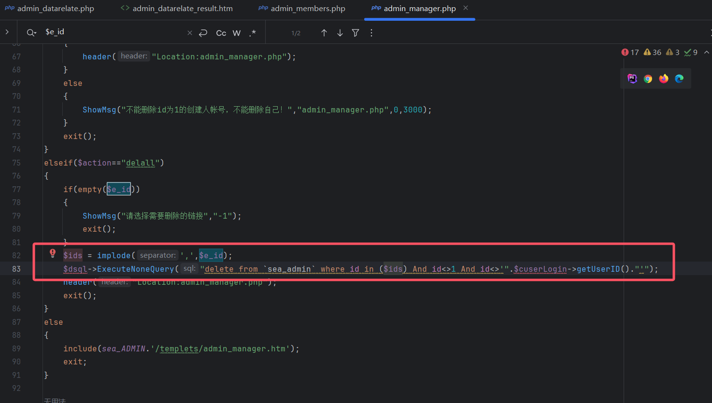
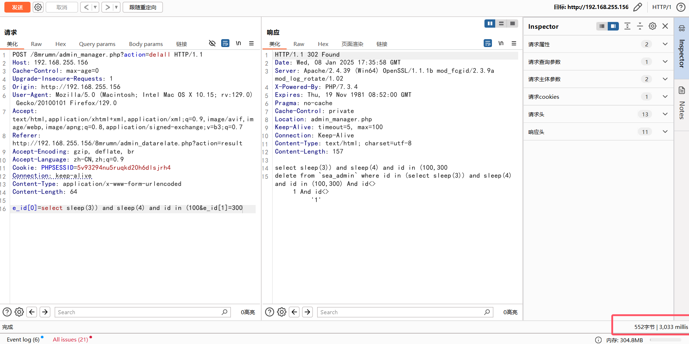

# CVE-2025-44072
# Analysis Report:

filename: \SeaCMS_13\Upload\o09sqn\admin_manager.php

Variables are simply concatenated directly into sql statements resulting in sql injection

# Verification

Sending a request triggers sql injection

