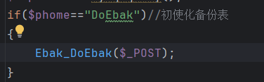
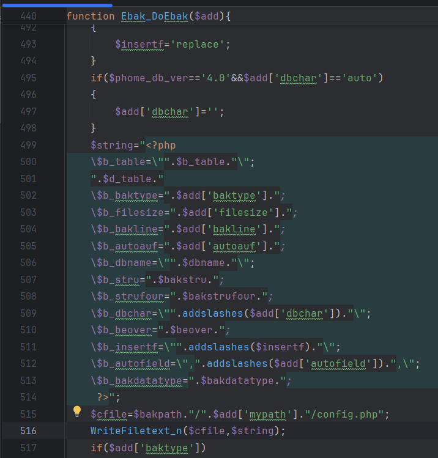
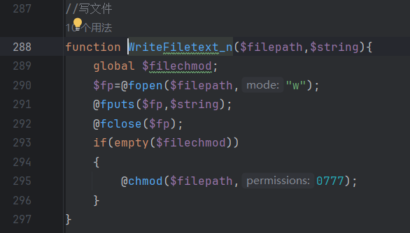
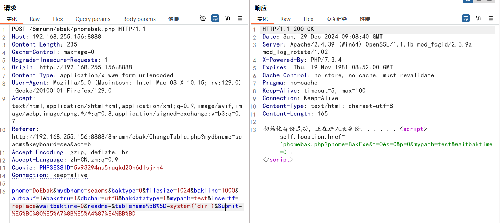
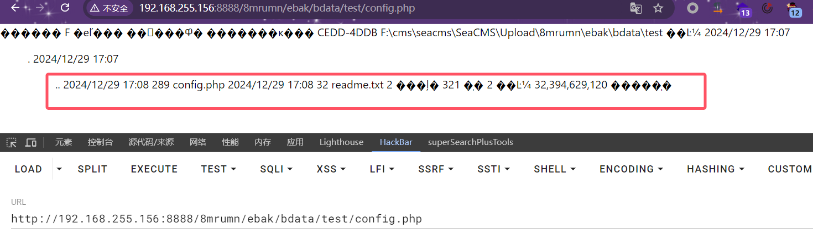

# CVE-2025-44071 
# Analysis Report:

filename: \SeaCMS\Upload\admin\ebak\phomebak.php

In the Ebak_DoEbak() function, the passed parameters are written into a config.php file, and the variable value $b_table written comes from the tablename parameter in post. It is directly written into config.php without any filtering or validation.

Construct a request to write malicious code into a PHP file. Once accessed, it will be parsed.

## Verification

Sends a request to create a config.php file under the specified directory (test) and writes malicious code to config.php.

The generated congfig.php file is accessed and the system commands are successfully executed.

